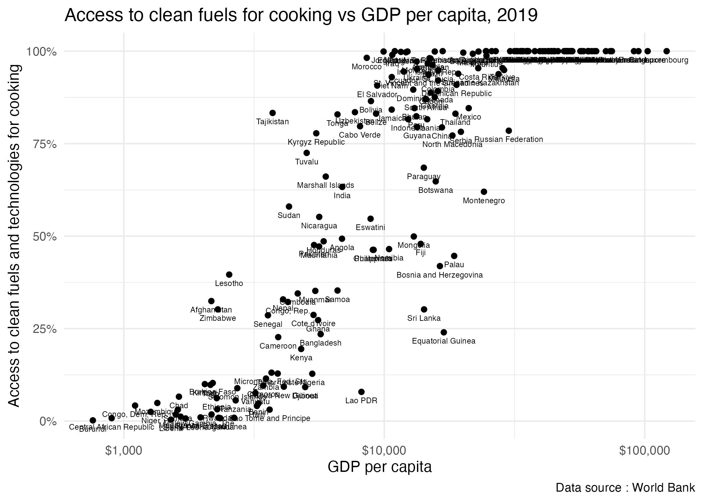

# Access to clean energy for cooking

The inspiration for this project comes from [tidytuesday](https://github.com/rfordatascience/tidytuesday/blob/master/data/2022/2022-04-12/readme.md) data about indoor air pollution.

The objective of the project is to recreate the graph created by [Our Word in Data](https://ourworldindata.org/indoor-air-pollution) specifically to analyze the relationship between the percentage of access to clean energy for cooking and the gross domestic product.

The data was downloaded from :

-   [DataBank : World Development Indicators](https://databank.worldbank.org/source/world-development-indicators)

The search for information had the following criteria:

-   Data from 217 countries.
-   Series 1 : Access to clean fuels and technologies for cooking (% of population)
-   Series 2: GDP per capita, PPP(current international \$)

## Reading the data

``` r
clean_fuels_cooking_raw <- read_csv("data-raw/access-clean-fuels-cooking.csv") |> 
  clean_names()

gdp_ppp_capita <- read_csv("data-raw/gdp-ppp-capita.csv") |> 
  clean_names()
```

## Data cleaning

The cleaning of the data included the selection of the data from 2000 to 2019 for both datasets. Then the pivot_longer function was used to increase the number of rows and decrese the number of columns.

Finally the str_remove_all function was used with the pattern "x\\d+\_yr", which allowed the following

-   x: Matches the literal character "x".
-   \\d+: Matches one or more digits using the + quantifier.
-   \_yr: Matches the literal characters "\_yr".

``` r
clean_fuel_cooking_by_year <- clean_fuels_cooking_raw |> 
  select(country_name, country_code, x2000_yr2000:x2019_yr2019) |> 
  pivot_longer(cols = "x2000_yr2000":"x2019_yr2019",
               names_to = "year",
               values_to = "acfc") |> # % percentage of population with access clean fuel for cooking
  mutate(year = str_remove_all(year, pattern = "x\\d+_yr")) |> 
  mutate(year = parse_number(year)) |> 
  mutate(acfc = parse_number(acfc)) |> 
  mutate(id = row_number())
```

## Binding data frames

The data sets were joined using the lef_join function, NA were omitted and the final dataset were exported as a rds file

``` r
gdp_clean_fuels <- left_join(gdp_ppp_capita_by_year,
          clean_fuel_cooking_by_year,
          join_by(id, country_name, country_code, year),
          keep = FALSE)

gdp_clean_fuels_by_year <- na.omit(gdp_clean_fuels)

access_clean_fuel_gdp <- relocate(gdp_clean_fuels_by_year, id, .before = country_name)

write_rds(access_clean_fuel_gdp,
          file = "data/access_clean_fuel_gdp.rds")
```

## Data viz

The rds file was imported to a qmd document, filtered by year (2019) and then The following graph was generated


